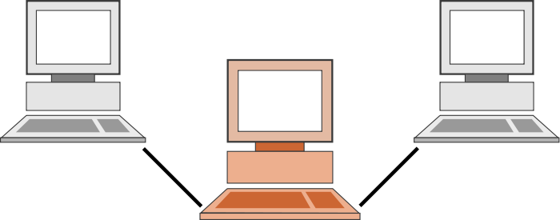
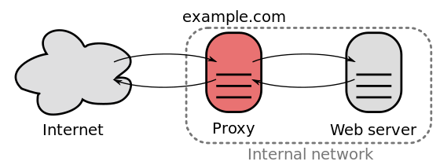

class: center, middle

# 反向代理

&nbsp;
&nbsp;

#### 邵嘉伦 (shaojialun@pku.edu.cn)  

主页: https://github.com/gallenshao

2017年11月9日

---

## 前向代理

代理（英语：Proxy）也称网络代理，是一种特殊的网络服务，允许一个网络终端（一般为客户端）通过这个服务与另一个网络终端（一般为服务器）进行非直接的连接。



---

## 反向代理

与前向代理不同，前向代理作为一个媒介将互联网上获取的资源返回给相关联的客户端，而反向代理是在服务器端（如Web服务器）作为代理使用，而不是客户端。



---

## 区别

客户端通过前向代理可以访问很多不同的资源。

反向代理是很多客户端都通过它访问不同后端服务器上的资源，而不需要知道这些后端服务器的存在，而以为所有资源都来自于这个反向代理服务器。

---

## 反向代理作用

See [Reverse proxy - Wikipedia](https://en.wikipedia.org/wiki/Reverse_proxy)

### 1. 隐藏原始服务器
Reverse proxies can **hide the existence and characteristics** of an origin server or servers.

### 2. 防火墙
Application **firewall** features can protect against common web-based attacks, like DoS or DDoS.

### 3. HTTPS
In the case of **secure websites**, a web server may not perform SSL encryption itself, but instead offloads the task to a reverse proxy that may be equipped with SSL acceleration hardware.

### 4. 负载均衡
A reverse proxy can **distribute the load** from incoming requests to several servers, with each server serving its own application area.

### 5. 缓存
A reverse proxy can reduce load on its origin servers by **caching static content**, as well as dynamic content - synonym: web acceleration.

### 6. 内容压缩
A reverse proxy can optimize content by compressing it in order to speed up loading times.

### 7. 分页？
In a technique named "**spoon-feed**"[2] a dynamically generated page can be **produced all at once** and served to the reverse-proxy, which can then return it to the client **a little bit at a time**. 

### 8. Docklet
Reverse proxies can operate wherever multiple web-servers must be accessible via **a single public IP address**.

### 9.
Commercial or enterprise level out-of-box solutions exist and can have an agent installed on user systems to ensure a constant connection to a cloud proxy / reverse proxy server also a SaaS solution. 

### 10.
A reverse proxy can add basic HTTP access authentication to a web server that does not have any authentication.

---

## Multiple web-servers

一般都通过不同域名实现。

```
server { 
  server_name client.domain.com;

  # app1 reverse proxy follow
  proxy_set_header X-Real-IP $remote_addr;
  proxy_set_header Host $host;
  proxy_set_header X-Forwarded-For $proxy_add_x_forwarded_for;
  proxy_pass http://x.x.x.100:80;

}

server { 
  server_name client2.domain.com;

  # app2 reverse proxy settings follow
  proxy_set_header X-Real-IP $remote_addr;
  proxy_set_header Host $host;
  proxy_set_header X-Forwarded-For $proxy_add_x_forwarded_for;
  proxy_pass http://x.x.x.100:80;
}
```

---

## Docklet解决方案的缺点

无法使用多域名，反向代理路由只能依赖URL，此部分却对用户服务器隐藏。

用户服务器返回的网页（如`iwork.pku.edu.cn/user1/index.html`）若需要访问根目录资源，如``，会导致浏览器自动拼接域名和路径，使用`iwork.pku.edu.cn/image/1.png`请求该资源，而此操作跳过了反向代理服务器。

而上述路径的生成可能是动态的不可控的，因此无法在反向代理器统一对其做修改。最佳情况下只能做到大部分场景下（静态页面）可用，且无法保证该修改是没有副作用的。

---

## VPN解决方案

尚未开始调研，对vpn也不了解，但有两种不成熟的想法：

1. 每个用户一个vpn账号，用于访问其内容，但从用户角度讲体验其实比较差
2. 在阿里云服务器使用二级域名对用户服务器进行区分（我还是没有放弃这个想法），使用vpn实现阿里云访问北大内部的资源。

---

class: center, middle

# 谢谢
