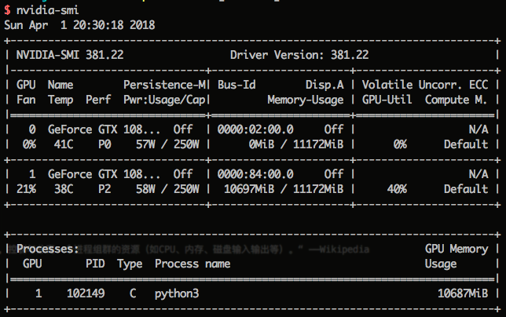
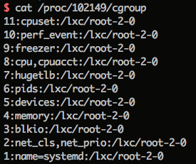

class: center, middle

# Docklet显卡虚拟化方案

&nbsp;
&nbsp;

#### 邵嘉伦 (shaojialun@pku.edu.cn)  

主页: https://github.com/gallenshao

2018年4月2日

---

## 已知条件

### PassThrough

- Container中的驱动版本必须与Host中一样

- 可以动态映射、移除/dev/nvidia0、/dev/nvidia1等显卡设备

- 必须预先映射/dev/nvidiactl、/dev/nvidia-uvm两个设备

### mount方式

1. 修改/var/lib/lxc/root-1-0/config文件

2. 使用lxc-device命令动态映射

支持多容器同时mount同一个显卡设备

---

## 可能的共享方式

### 用户需要使用GPU的时候动态申请，独占GPU

1. 每次至多申请一块

2. 需要设置一个较高的使用费

3. 容易造成资源浪费

4. 在使用过程中移除设备不会影响程序运行，需监控内存使用情

---

## 实现方式

### 一个申请GPU的接口

lxc-device -n root-1-0 add /dev/nvidia0

每块GPU同时只能有一个用户使用

### 一个释放GPU的接口

需要通过定时循环的监控线程，直到GPU资源被释放才结算

### 一个监控线程

若用户豆不够了得取消其使用资格（并强制停止其运行程序？）

---

## 可能的共享方式

### 所有用户同时共享所有GPU

1. 依据显存使用情况来计算费率

2. 需要通过某种方式来判断每个用户使用了多少显存

3. 需要明显的提示来告知用户节省显存

4. 可以支持大量的小规模的使用

---

## 可能的共享方式

### 用户需要使用GPU的时候动态申请，允许多用户共享

1. 用户与GPU是一对多的关系

2. 不好判断应该分哪块gpu给该用户

3. 一定程度上限制了用户对显卡的最大使用量

4. 使用逻辑较为复杂

---

## nvidia-smi

---

## cgroup

”cgroups，其名称源自控制组群（control groups）的简写，是Linux内核的一个功能，用来限制，控制与分离一个进程组群的资源（如CPU、内存、磁盘输入输出等）。“ ——Wikipedia

---

## 实现方式

### 一个循环线程

1. 通过nvidia-smi获取当前运行程序的列表

2. 通过pid从cgroup中获取其所属container

3. 通过container与docklet配置文件获取用户

4. 计算费用

---

## 镜像制作

1. 需要预装好与Host版本一致的GPU驱动

2. 修改config文件，默认mount /dev/nvidiactl 和 /dev/nvidia-uvm 两个设备

3. 可以顺便预装好cuda、cudnn、tensorflow，也可以让用户自己安装

---

class: center, middle

# 谢谢
