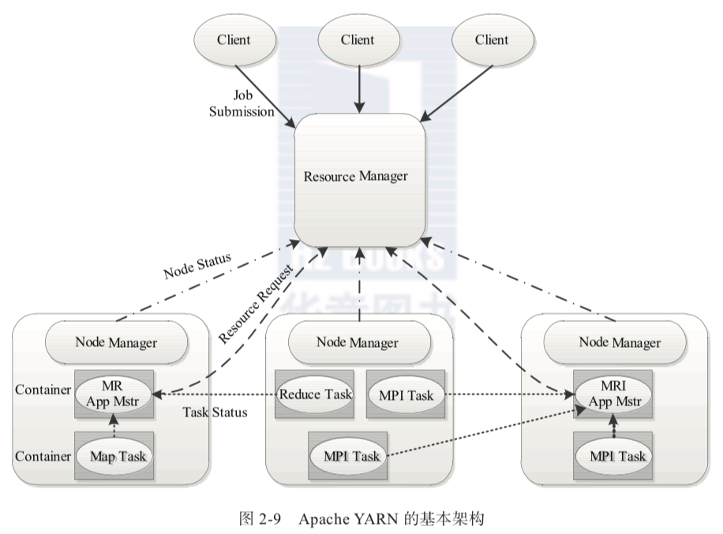
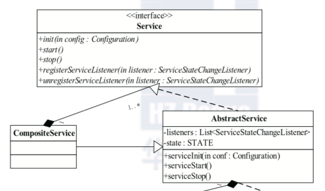
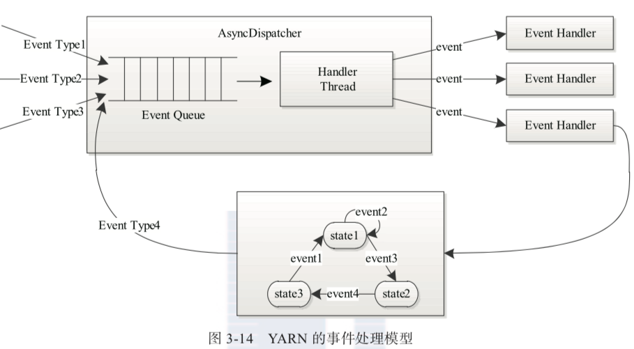

class: center, middle

# yarn 源码阅读

&nbsp;
&nbsp;

#### 邵嘉伦 (shaojialun@pku.edu.cn)  

主页: https://github.com/gallenshao

2018年8月6日

---

## 内容

### <font color="orangered">1. yarn 总体架构</font>

### 2. yarn 通信机制

#### &nbsp; &nbsp; 2.1 RPC
#### &nbsp; &nbsp; 2.2 Event

### 3. yarn 资源调度方案

#### &nbsp; &nbsp; 3.1 上层设计
#### &nbsp; &nbsp; 3.2 队列设计
#### &nbsp; &nbsp; 3.3 CapacityScheduler

---

## yarn 架构

yarn 主要由 ResourceManager、NodeManager、 ApplicationMaster(图中给出了 MapReduce 和 MPI 两种计算框架的 ApplicationMaster，分 别为 MR AppMstr 和 MPI AppMstr)和 Container 等几个组件构成。



---

## 内容

### 1. yarn 总体架构

### <font color="orangered">2. yarn 通信机制</font>

#### &nbsp; &nbsp; <font color="orangered">2.1 RPC</font>
#### &nbsp; &nbsp; 2.2 Event

### 3. yarn 资源调度方案

#### &nbsp; &nbsp; 3.1 上层设计
#### &nbsp; &nbsp; 3.2 队列设计
#### &nbsp; &nbsp; 3.3 CapacityScheduler

---

## 设计模式 - 工厂模式

使用 ShapeFactory 并传入参数 `Circle/Rectangle/Square` 创建 Shape 类，在持有 ShapeFactory 实例的 FactoryPatternDemo 中不需要关心 Shape 的实现与具体类别，实现一定程度上解耦。


---

## 设计模式 - 抽象工厂模式

可以理解为工厂的工厂，使用 FactoryProducer 并传入参数 `Shape/Color` 生成的 Factory，并依据需求生成不同的目标实例


---

## yarn 对 rpc 的封装

yarn 对 rpc 的封装体现在两个部分：

1. 对 rpc server 和 client 的封装
2. 对消息类型的封装

yarn 对 rpc 的封装过程中大量使用了 java 的反射机制和抽象工厂模式，这两者结合，获得了远胜普通抽象工厂的解耦效果。

---

## 对 rpc server 的封装

以 yarn 中的 slave 向 master 发送心跳请求为例，yarn 定义了一个接口名为 `ResourceTracker` 作为 rpc 交互的接口。

在 `ResourceTracker` 的实现类 `ResourceTrackerService` 中通过如下方式启动 server：

```java
YarnRPC rpc = YarnRPC.create(conf);
server = rpc.getServer(ResourceTracker.class, this, ...);
server.start()
```

最顶层是一个抽象类 YarnRPC

```java
public abstract Object getProxy(...);

public abstract void stopProxy(...);

public abstract Server getServer(Class<?> protocol, Object instance, ...);

public static YarnRPC create(Configuration conf) {}
```

---

## 对 rpc server 的封装

其 `create` 函数，依据传入参数，通过反射的方式获得其实现类，如默认值 `HadoopYarnProtoRPC`，而这个类基本是一个对 `RpcFactoryProvider` 类的封装，其本质是一个抽象工厂，`HadoopYarnProtoRPC` 的 `getServer` 函数中，直接调用了如下语句：

```java
RpcFactoryProvider.getServerFactory(conf).getServer(protocol, instance, ...)
```

而 `getServerFactory` 函数中，又依据传入的参数做反射得到接口 `RpcServerFactory` 的实现类 `RpcServerFactoryPBImpl`

在 `RpcServerFactoryPBImpl` 中，将 `ResourceTracker` 的包名和类名做修改后，再次通过反射获取其实现类 `ResourceTrackerPBServerImpl`，并将之前传入的 `instance` 传给他。

最终的 `ResourceTrackerPBServerImpl` 才是接受 RPC 请求的关键数据结构，其继承于 `ResourceTrackerPB`，是由 Protocol Buffers 依据 proto 文件自动生成的。它作为 `ResourceTracker` 和 `ResourceTrackerPB` 的一个适配器而存在。

有了这个 `ResourceTrackerPBServerImpl`， `RpcServerFactoryPBImpl` 就可以按照 rpc 的规则来构建服务器并返回了。

---

## 对 rpc server 的封装

总的来说，对 server 的封装过程中主要涉及两次重要的反射：

1. 获取 `HadoopyarnProtoRPC`，其中封装了 `RpcFactoryProvider`
2. 获取 `RpcServerFactoryPBImpl`，其中定义了如何从接口类 `ResourceTracker` 获取到监听了 `ResourceTrackerPB` 的 RPC 服务器的方式

上述两次反射目标均直接由 Configuration 即配置文件定义，也就实现了组件/工厂的热插拔。在更换组件时，只需要单独编写组件的实现类，并修改配置文件即可，不需要对其他任何文件进行修改。

---

## 对消息类型的封装

yarn 中对消息类型的封装也是抽象工厂+反射的模式。

入口是 `RecordFactoryProvider`，调用其静态函数可依据配置文件以反射的方式获得对应的 `RecordFactory`：

```java
public static RecordFactory getRecordFactory(Configuration conf) {}
```

而在其默认实现 `RecordFactoryPBImpl`中，同样以修改包名和类名+反射的方式获取传入的接口类对应的实现类的实例：

```java
public <T> T newRecordInstance(Class<T> clazz) {}
```

其默认做法是将 `[package].[class]` 映射为 `[package].impl.pb.[class]PBImpl`

---

## 内容

### 1. yarn 总体架构

### 2. yarn 通信机制

#### &nbsp; &nbsp; 2.1 RPC
#### &nbsp; &nbsp; <font color="orangered">2.2 Event</font>

### 3. yarn 资源调度方案

#### &nbsp; &nbsp; 3.1 上层设计
#### &nbsp; &nbsp; 3.2 队列设计
#### &nbsp; &nbsp; 3.3 CapacityScheduler

---

## 基于服务的对象管理模型

yarn 中所有服务对象都实现了 `Service` 接口，而大多数 `Service` 均继承于一个最简单的类 `AbstractService` 实现。

`CompositeService` 是一种特殊的服务，其维护了一组与它自身生命周期相同的服务。yarn 的 `ResourceManager` 和 `NodeManager` 都是一种 `CompositeService`。一般而言，一个服务就是一个 `Thread`。



---

## 基于事件驱动的并发模型

yarn 中所有核心服务实际上都是一个中央异步调度器，包括 `ResourceManager`、`NodeManager` 等。中央异步调度器也是一个服务，在 `ResourceManager` 等 `CompositeService` 中以其中一个组件的形式存在。并在 `RMContext` 中，供其他 `Service` 调用。

依据不同的事件类型，中央异步调度器将事件转发给注册了该事件的一个或多个 `EventHandler`（通常就是其他 Service），事件处理若有返回值也会以事件形式返回。



---

## 状态机

事件驱动天然适合配合状态机的使用。yarn 中抽象了一种 `StateMachine` 并提供了 `StateMachineFactory` 以方便地构建一个状态机。

下面就是 `RMNodeImpl` 中初始化其状态机的开头，其定义了一种初始状态为 `NEW` 的状态机。并注册了一种行为：若当前状态是 `NEW`，并收到了一个 `STARTED` 事件，则触发由 `AddNodeTransition` 定义的行为，并在把结束状态置为 `RUNNING`。

```java
private static final StateMachineFactory<RMNodeImpl,
                                           NodeState,
                                           RMNodeEventType,
                                           RMNodeEvent> stateMachineFactory 
                 = new StateMachineFactory<RMNodeImpl,
                                           NodeState,
                                           RMNodeEventType,
                                           RMNodeEvent>(NodeState.NEW)
      //Transitions from NEW state
      .addTransition(NodeState.NEW, NodeState.RUNNING,
          RMNodeEventType.STARTED, new AddNodeTransition())
      .addTransition...
```

---

## 内容

### 1. yarn 总体架构

### 2. yarn 通信机制

#### &nbsp; &nbsp; 2.1 RPC
#### &nbsp; &nbsp; 2.2 Event

### <font color="orangered">3. yarn 资源调度方案</font>

#### &nbsp; &nbsp; <font color="orangered">3.1 上层设计</font>
#### &nbsp; &nbsp; 3.2 队列设计
#### &nbsp; &nbsp; 3.3 CapacityScheduler

---

## 上层设计

接口 `ResourceScheduler` 继承于 `EventHandler<SchedulerEvent>`

而调度器的一种基础实现 `AbstractyarnScheduler` 继承于 `AbstractService` 实现了 `ResourceScheduler`，因此 yarn 中调度器是以一种接受 `SchedulerEvent` 事件驱动的服务组件而存在。

yarn 中资源分配的过程：

1. `NodeManager` 通过心跳汇报节点信息，`ResourceManager` 返回心跳应答，包括需要释放的 `Container` 列表等信息，并触发 `NODE_UPDATE` 事件
2. `ResourceScheduler` 收到 `NODE_UPDATE` 事件后，按一定策略将上述释放的资源分配个各应用程序，并把分配结果存在某个内存数据结构中
3. `ApplicationMaster` 向 `ResourceManager` 发送心跳领取被分配的 `Container`
4. `ApplicationMaster` 将分配的 `Container` 进一步分配给它内部的各个任务

---

## 内容

### 1. yarn 总体架构

### 2. yarn 通信机制

#### &nbsp; &nbsp; 2.1 RPC
#### &nbsp; &nbsp; 2.2 Event

### 3. yarn 资源调度方案

#### &nbsp; &nbsp; 3.1 上层设计
#### &nbsp; &nbsp; <font color="orangered">3.2 队列设计</font>
#### &nbsp; &nbsp; 3.3 CapacityScheduler

---

## 资源抢占模型

yarn 中的资源抢占模型由队列来描述。每个队列可以设置一个最小资源量和最大资源量。

- 最小资源量是资源紧缺情况下每个队列需要保证的资源量
- 最大资源量则是在任何情况下列队都不能超过的资源使用量
- 队列需要的资源小于最小资源量时，空闲资源可能会暂时分配给其他队列，在该队列需要时再抢占（通常会先等待一小段时间）
- 抢占策略是可插拔式的

---

## 层级队列管理机制

yarn 中的队列并不是平级的，而采用了一种层级队列管理机制。典型应用场景如下：管理员将所有资源划分给若干队列，每个队列对应一个”组织“，如其中有一个”Org1“组织，分到了60%的资源，它内部包含三种类型应用：

- 产品线应用
- 实验性应用，分属三个不同项目
- 其他类型应用

假设Org1管理员想更有效地控制这60%的资源，如将大部分资源给产品线，但同时又让其他类型应用有最少资源保证，可以这样配置资源：

```
grid {
  Org1 min=60% {
    priority min=90% {
      production min=82%
      proj1 min=6% max=10%
      proj2 min=6%
      proj3 min=6%
    }
    miscellaneous min=10%
  }
  Org2 min=40%
}
```

---

## 层级队列管理机制

yarn 中队列有以下特性

- yarn 中队列的管理直接受配置文件的控制，似乎也设置了管理员系统在运行时修改
- 队列可以嵌套，每个队列均可以包含子队列
- 用户只能将应用程序提交到最底层的队列，即叶子队列 `LeafQueue`
- 每个子队列均有一个最少容量比的属性，表示可以使用父队列容量的百分比
- 一般情况下调度器会优先选择资源利用率最低的队列

队列管理机制由用户权限管理和系统资源管理两部分组成：

- 不同用户对于不同队列有不同的权限，如管理员可以杀死队列中任何应用程序、改变任何应用程序的优先级等
- 管理员可以在调度器中配置每个队列的资源容量、每个用户可用资源容量等信息。

---

## 内容

### 1. yarn 总体架构

### 2. yarn 通信机制

#### &nbsp; &nbsp; 2.1 RPC
#### &nbsp; &nbsp; 2.2 Event

### 3. yarn 资源调度方案

#### &nbsp; &nbsp; 3.1 上层设计
#### &nbsp; &nbsp; 3.2 队列设计
#### &nbsp; &nbsp; <font color="orangered">3.3 CapacityScheduler</font>

---

## CapacityScheduler

`CapacityScheduler` 对外接口主要分成两部分：

- `ResourceManager` 接收到 `ApplicationMaster` 的心跳请求时会显式调用 `Scheduler` 的 `allocate` 函数（实际处理心跳请求的是一个叫 `ApplicationMasterService` 的子服务）
- `CapacityScheduler` 本身作为一个 `EventHandler` 存在，注册了 `SchedulerEvent`，处理 `NODE_ADD`、`NODE_UPDATE`、`APP_ADD` 等事件


---

## 调度过程

`CapacityScheduler` 的调度过程如下：

#### 1. 选择节点

1. `CapacityScheduler` 作为一个 `Service`，在启动时会依据配置文件启动若干个调度线程 `AsyncScheduleThread`
2. 每个异步调度线程会随机遍历所有 `Node`，并尝试在每个 `Node` 上申请 `Container`
3. `CapacityScheduler` 在接收到 `NODE_UPDATE` 事件即 `NodeManager` 的心跳请求后也会尝试在该节点上重新申请 `Container`

#### 2. 选择队列

采用了基于优先级的深度优先遍历方法，按照子队列资源使用率从小到大一次遍历，具体排序策略可插拔，默认实现为 `PriorityUtilizationQueueOrderingPolicy`：
1. 优先基于本地性排序
2. 其次基于已使用资源的比例排序
3. 最后基于资源总量的绝对值排序

---

## 调度过程

#### 3. 选择应用

一个 `LeafQueue` 中包含多个应用，因此需要选择一个应用，具体策略也是可插拔的，有 `fifo` 和 `fair` 两种，默认实现为 `FifoOrderingPolicy`：
- 直接基于应用提交时间排序，越早提交优先级越高
- 实际实现中使用 `ApplicationID` 作为依据

#### 4. 选择Container

同一个应用申请的 `Container` 也是多样化的，涉及不同的优先级、节点、资源量、数量等

`CapacityScheduler` 会优先选择优先级高的 `Container`，其次优先满足本地性的 `Container`

#### 5. 调度结果

最终，调度结果会被存放在一个数据结构中（`FiCaSchedulerApp`），下次 `ApplicationMaster` 心跳请求调用 `allocate` 函数时，就会从中取出来返回。

---

class: center, middle

# 谢谢
